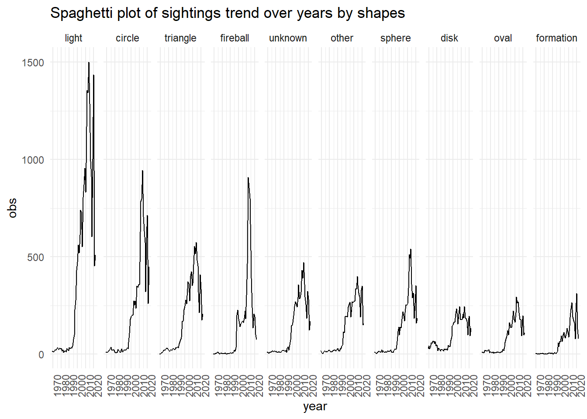

```{css echo = FALSE}
img.center {
  width: 75%;
  display: block;
  margin-left: auto;
  margin-right: auto;
}

.column3 {
  float: left;
  width: 33.33%;
  padding: 5px;
}

.column2 {
  float: left;
  width: 50%;
  padding: 5px;
}

.column2, .column3 p{
  text-align: center;
  font-weight: bold;
  text-decoration: underline;
}

/* Clear floats after image containers */
.row::after {
  content: "";
  clear: both;
  display: table;
}
```


### Motivation
Our project explores the reporting of unidentified flying objects (UFOs) throughout the U.S. UFOs, by their very nature, leave unanswered questions, some of which we hoped to explore through this project. With the wealth of information gathered about these phenomena and motivated by the [congressional hearings](https://www.cnn.com/2023/07/26/politics/ufo-house-hearing-congress/index.html) [earlier this year](https://www.pbs.org/newshour/politics/analysis-whistleblower-testimonies-did-not-change-our-basic-understanding-of-ufos), we wanted to create a resource to understand the data on UFO encounters. Our project addresses three key components to provide this understanding: when the encounters happened, where the encounters happened, and what was encountered.

### Related Work 
Inspired by the [National UFO Reporting Center](https://nuforc.org/), research such as [Faculty perceptions of unidentified aerial phenomena](https://www.nature.com/articles/s41599-023-01746-3), [The Scientific Investigation of Unidentified Aerial Phenomena (UAP) Using Multimodal Ground-Based Observatories](https://www.worldscientific.com/doi/10.1142/S2251171723400068), our project seeks to expand on existing research using advanced statistical methods and R programming.

### Initial Questions 
We started with basic questions such as:

* What are the hotspots for UFO sightings? 
* What are the common characteristics of UFO sightings?
* How have reports of UFO sightings changed over time?
* Are there common features in these reports that can be quantitatively analyzed?

As our project progressed, we explored more nuanced questions.

### Evolution of Questions
* Do certain geographical areas have higher frequencies of certain types of UFO sightings?
* Has the nature of UFO sightings changed over time? For example, a follow-up to temporal pattern analysis looks at changes in characteristics (shapes) of sightings across different decades.
* Are there correlations between UFO sightings and other variables?
* Will mentioning certain words in the report affect the duration of sightings or other variables?

### Data 
Our primary work was on data collected by the National UFO Reporting Center (NUFORC). [Timothy Renner](https://data.world/timothyrenner) pulled and hosted the data version we used separately. We restricted our analysis to UFO reports made within the U.S.A. and removed reports that contained inconsistent locations (some reported U.S. but showed longitudes and latitudes in South America, Europe, or Canada) or were missing fundamental values. This left us with 100,820 reports from an initial set of 141,261 reports.

The duration of the UFO encounter was reported in the text and had inconsistent formatting, as well as unexpected special characters, e.g., “~8 minutes," “30 SECS," or “3 hours or more.”. We wrote a function to identify numeric time values within these strings and the appropriate time units (seconds, minutes, and hours) and convert these reports to numbers of seconds. While this approach wasn’t perfect, it allowed us to perform subsequent analyses on most of the data.
We incorporated data from a few additional sources as well. To locate cities that were near the location of UFO reports, we utilized a U.S. city dataset from [simple maps](https://simplemaps.com/data/us-cities). We used decennial census data from the [U.S. Census Bureau](https://www2.census.gov/programs-surveys/popest/datasets/) to control for differing populations across states. We also incorporated basic information about U.S. geography from R and the [GeoJSON dataset](https://geojson.org/).

We also created new variables using packages such as  `stringr` and `spacyr`. The `spacyr` package helps to dissect long comments into words. These words are automatically processed into their root word, or lemma, and are tagged by their parts of speech. Due to the size of the dataset, only 5000 random samples are used in the dataset. We created two other variables: color, which extracts the first appearance of color given by the report, and adj, which records the appearance of the top 20 adjectives in the comments in binary form. The color analysis uses keywords generated from R's built-in function `colors()`, and the adjective analysis uses keywords by filtering the top 20 from the `spacyr` data frame.


### Exploratory Analysis 
Our exploratory analysis included the following:


#### Trends over space
We began with an exploration of the distribution of UFO sightings, first throughout the U.S. and then by distance to large cities. The initial plotting of UFO sightings revealed three geographic hotspots: the Pacific Northwest, Northern New England, and the Arizona-New Mexico region. 


Then, as we compared sightings made in a rural area with those made in a rural one, we began to see differences between these groups. Encounters in rural areas were longer (p-value: 3.39e-10), and had differing characteristics than those in urban/suburban areas (p-value: 3.08e-7). These differences were explored further in a comprehensive textual analysis of the reports.


 
#### Trend and Adjusted Trend Over Years by States


Following 1995, there was a significant increase in UFO sightings, possibly due to the internet's quick development. Most states saw a peak in sightings around 2014, then a decline. Nearly all states experienced sharp declines in sightings in 2018, and then there was an increase in 2019 and 2020. UFO sightings within individual states varied significantly from year to year, with some states showing sharp increases or decreases.  The number of UFO reports in California consistently outnumbered those in other states, possibly due to population effects.


After adjusting for population, the overall trend mirrored the aggregate sighting trend, with a rapid increase post-1995 and a peak around 2014. Vermont consistently had the highest sightings per 1 million population, indicating a potential hotspot.

#### Trend and Adjusted Trend Over Months by States 


Sightings showed seasonal variations, with summer having the highest reported sightings in most states. Some states, such as Florida, experienced peak sightings in December, indicating regional variations. Washington State showed a unique rapid increase starting in May and a sharp decrease after July.


Adjusting for population had a minimal impact on the trend over the past few months. However, Alaska showed a unique trend with the highest sightings per 1 million in winter, potentially related to polar night.

#### Trend Over Hours by States


UFO sightings were more commonly reported during the evening hours, peaking around 21:00. Sightings during daytime hours, particularly from 6:00 to 15:00, were relatively low.

#### Trend Over Weekdays by States


The average sightings increased gradually from Monday to Saturday, peaking on Saturday, then decreasing on Sunday.  California showed a decline from Sunday to Monday, with an increase during the weekdays and a peak on Saturday.

#### Trend Over Time by UFO Shapes



Light, circles, and triangles were the most observed UFO shapes, following a similar trend of rapid increase, peaking around 2014, decline in 2018, and another peak in 2020. Fireball had a peak before 2000, while disk sightings showed a steady increase in the 1970s.

#### Adjectives Used in the Report Before and After 2000:

Adjectives used before 2000 exhibit greater diversity and complexity, featuring descriptors like "approximate," "entire," "exact," "round," "huge," and "slow." In contrast, post-2000 adjectives tend to be brief, including terms such as "clear," "slow," and "big." The prevalence of contemporary words like "anonymous" in post-2000 data may be attributed to the surge in UFO reports with the rise of internet usage. The difference in average education levels between those reporting before and after 2000, as well as the recent increase in photographic information availability, may also have an impact on this shift. Additionally, post-2000 messages tend to be more concise and direct, possibly to expedite information dissemination.

```{=html}
<div class="row">
  <div class="column2">
    
    <p>Before 2000</p>
  </div>
  <div class="column2">
    
    <p>After 2000</p>
  </div>
</div>
```

### Text Analysis

**Top Nouns:** These words primarily identify elements related to UFO sightings. They encompass the UFO itself (light, object), the setting (sky, night, minute, second), and items used to distinguish UFOs from conventional objects (star, plane, craft).

**Top Verbs:** These verbs describe the actions and reactions of both observers and the UFO. They encapsulate observations (see, look, watch), movement (move, fly), and perceptions (appear, disappear).

**Top Adjectives:** These words are descriptive but don’t fall strictly into noun or verb categories. They are being analyzed for potential correlations with UFO sighting duration. They include descriptors like brightness (bright, high, large), colors (red, white, blue, orange, green, dark), quantity (few, many), clarity (clear, visible), and peculiarity (strange, different).

```{=html}
<div class="row">
  <div class="column3">
    
    <p>Nouns</p>
  </div>
  <div class="column3">
    
    <p>Verbs</p>
  </div>
  <div class="column3">
    
    <p>Adjectives</p>
  </div>
</div>
```

#### Correlation & Regression Analysis

**Color vs Rural/Urban**
To ascertain any potential relationship between color and location, we conducted a Chi-Square Test, yielding a significant p-value of 2.39e-09. As the location variable is binary, we proceeded to perform a logistic regression analysis between the variables. Through this analysis, we uncovered that gray and black colors exert a positive influence on the likelihood of sightings in rural locations, potentially due to their alignment with rural surroundings. Conversely, colors frequently mentioned, such as white, red, and yellow, demonstrate minimal impact in distinguishing between rural and urban settings.

**Color vs Duration**
The dependent variable, duration, is continuous, prompting us to apply a Box-Cox transformation for normalization. After this transformation, we used the logarithm of duration as the final dependent variable. By ANOVA analysis, we observed that color frequency may impact the relationship between color and duration. To address this, we standardized colors based on their overall frequency. Subsequently, we conducted a comprehensive linear regression analysis between duration and color, employing stepwise backward regression based on AIC.

Both the full regression and the backward elimination regression models revealed an R-squared value of 0.042, indicating a markedly weak correlation. Notably, the estimates suggest that colors like green and gray significantly reduce the duration of sightings, while the color red, conversely, increases the duration of observations."

**Color vs Shape**


We constructed a heatmap/correlation matrix to examine the relationship between all color variables and shape variables. This matrix was adjusted by the frequency of each color. The matrix is re-weighted by the frequency of the color. Less common colors like honeydew (disk), magenta (light), and khaki (egg) demonstrate a stronger correlation with specific shapes compared to other colors. There is also a high correlation with common combinations such as white light, white fireball, etc.. Conversely, rare combinations such as gray fireball, gray flash, brown light, etc., exhibit a lower correlation.

**Color vs Time of Day**
After plotting the two variables, it appears that the scores are uniformly distributed, indicating no discernible relationship between color and time of day.

**Adjective vs. Duration**


We conducted a series of analyses including linear regression, ANOVA for result assessment, followed by cross-validation-based linear regression, and LASSO regression. Using the coefficients we get from the LASSO regression, we discovered the following: Shorter duration sightings tend to report general (clear, significant, high) and evident words with less vivid colors (dark, green). In contrast, longer-duration sightings tend to report detailed (first, second, close, bright), less obvious (strange, small), and easily noticeable colors (orange, red, white, blue).

### Discussion
Our initial goal was to identify times and places where UFO reports were common. According to the data, sightings occur less frequently in remote locations than crowded urban areas. This implies that the more possible observers there are, the more likely it is that sighting reports will occur. But it also suggests that some geographical characteristics or other unidentified factors can contribute to the frequency of UFO encounters. Regarding the typical features of UFO reports, our research showed various observed forms and actions. But reports of "lights," "circles," and "discs" were standard, and they fit with the traditional UFO imagery that has been widely accepted in the media and popular culture.  

When exploring how reports of UFO sightings have changed over time, we conducted a temporal analysis that showed a noticeable increase in reported sightings during the late 20th century, which could be correlated with the rise in science fiction media during that time.  According to our analysis, the majority of states saw a surge in UFO encounters around 2014. There are multiple possible explanations for this peak. Increased public interest in significant celestial events, the availability of more digital recording equipment, and the widespread use of drones may have led to more sightings and reports. Social media's ability to spread information quickly contributed to this increase as well since sites like Facebook and Twitter have grown widely used and made it possible for sightings to be reported promptly. 

What's interesting about 2018 is how few sightings there were. It also corresponds with when drone technology became much more accessible to the general public. This may have contributed to initial bewilderment but ultimately improved public awareness of these objects and reduced the number of UFO reports. Furthermore, modifications to the reporting and data collection regulations might have affected the quantity of reported sightings. One possible explanation for this reduction could have been a modification to the reporting guidelines of the National UFO Reporting Center.

The upsurge of sightings in 2019 and 2020 may be attributed to various environmental and socio-cultural variables. Global lockdowns resulted from the COVID-19 pandemic, which started at the end of 2019 and continued throughout 2020. People may have spent extra time at home due to the lockdowns, taking a closer look at the sky and witnessing things they might not have noticed. Additionally, the Pentagon's UFO movies may have sparked the public's renewed interest in aerial phenomena, which may have led to an increase in the number of sightings reported.

Seasonal fluctuations with summer highs may be linked to greater outside activities and brighter skies, which raises the possibility of seeing strange events. Local events, weather patterns, or tourists may have an impact on regional variances, such as Florida's peak in December. The distinct atmospheric conditions during the polar night may be responsible for Alaska's winter peak, increasing the visibility or prevalence of certain aerial phenomena. A number of reasons could account for the rise in reports in the evenings: more people are at home to watch the sky, and lights in the sky become more visible as night falls. The decreased number of sightings during the day may mean that UFOs are less noticeable in the daylight or maybe because witnesses are too busy during the day to detect or report strange objects.

The steady rise in sightings before Saturday may indicate that people's capacity and propensity to record sightings are influenced by their free time. It's possible that people were getting ready for the upcoming workweek and spending less time gazing up at the sky on Sunday. California's distinct weekly pattern might be a reflection of social or cultural norms peculiar to the state, such as weekly celebrations that encourage individuals to gaze upward more frequently.

Most sightings were short—often lasting less than two minutes—according to the recorded and categorized sighting durations, which contribute to the quantitative aspects of the reports. This numerical component gives the typically subjective nature of UFO sighting accounts a veneer of objectivity.

It's possible that the abundance of lights, triangles, and circles represents common shapes of aerial vehicles or other objects that the general public is unlikely to recognize. Additionally, these shapes are frequently shown in media depictions of UFOs, which may sway people's accounts. The unusual trend of fireballs and disks may have been caused by particular UFO events or by cultural factors prevalent at the time that made certain shapes more "popular" or easily identifiable as UFOs.

Pre-2000 reports were more descriptive in language. However, reports written after 2000 were more concise. This difference in language use may be attributed to the evolving nature of communication in the digital age, where brevity is frequently rewarded for speedy information transmission. The term "anonymous" appears in reports from after 2000, which may point to a rise in people's desire for anonymity or privacy in the digital age. The change in terminology may also indicate shifts in the demographics of those reporting sightings of UFOs, as descriptions of sightings may differ depending on one's educational background or level of technological comfort. 

Terminologies such as "clear," "large," and "high" in reports imply that observers may accurately recognize certain traits even in situations where the interaction is brief. These terms convey a degree of confidence to the observer. Less striking hues like "dark" and "green" may only be observed in a transient sighting and thus not be as noticeable as others. The fact that observers have little time to comprehend and remember what happened may be the reason for the vague adjectives they employ; instead, they may choose to use more general descriptors that are less precise but still capture the main ideas of what they saw. The observer may have preferred to use more specific terms like "first," "second," "close," and "bright" since they had more time to examine the object closely and pick up on more subtle aspects. Upon closer examination, terms like "small" and "strange" may surface, enabling a comparison of the UFO's characteristics with those of the surrounding area. Easy-to-identify colors like "orange," "red," "white," and "blue" are reported, which implies that prolonged sightings provide witnesses with sufficient opportunity to see more vibrant colors that they might otherwise miss during a brief encounter.

### Limitations

Despite the insights achieved by the project, there are several limitations of note. The first is that we are limited by the quality of the reports themselves. Not only is the reliability of UFO witnesses in question, but the lack of a standardized reporting system means that the way reports were made was highly variable. The subjectivity of the encounter, and the requirement that the object observed be ‘unidentified’ further compounds this issue. We also do not know what reports were not made and if a lack of reporting corresponds to a lack of UFO sightings or simply an unwillingness to make that sighting known.

Additionally, we wish to acknowledge some limitations in our methods. We primarily worked with latitude and longitude data, which ignored relevant geographic features such as mountain ranges, bodies of water, and developed areas that might impact the probability of UFO sightings, as well as the distribution. Of particular note in the UFO literature is the impact of military bases on UFO report frequency. Additionally, we made the urban/suburban vs. rural areas distinction based upon distance to cities rather than the more precise metric of population density. Further, we looked at reports over several decades but did not have the data to control for technological changes across this timeframe, both with respect to flying objects (i.e., drones) and the means of observing them (i.e., camera improvements).

In our approach to the keyword detection process of the color analysis, the data was approached with an aggressive matter. Only the first color mentioned is extracted. The color could also identify the surroundings or the location name, hence creating misleading results from the findings. As advanced as the package Spacyr can be, there still exist errors in identifying the parts of speech of the parsed words. Misspelled words may not be identified by the algorithm.


### Final Thoughts
Our project delves into the intriguing subject of UFO sightings. By their very nature, these unidentified objects ask questions of the observer. We have used a data-driven approach to explore trends in these reports and open new avenues for inquiry.

Our results demonstrate that UFO sightings are not uniform throughout the U.S., nor do they perfectly correlate with population density. There are certain locations where UFO sightings occur with higher frequency, and the heterogeneity of these encounters asks even more questions of us as data enthusiasts. 

After everything is said and done, we’re left curious. A mystery that captivates our curiosity even after all the evidence we’ve examined about UFO sightings is still present. We still don’t know enough about this subject, which is what makes it so fascinating. We hope that our work raises more issues and encourages more research down the road.

#### Acknowledgments
As we draw to the end of our exploration journey into UFO encounters, we want to express our sincere and heartfelt thanks to everyone who helped with this project. We are  incredibly grateful to Professor Jeff Goldsmith and the TAs of P8105 for all of their hard work and contributions to our education. In addition to providing guidance for this project, the understanding and information we have acquired in this class have expanded our comprehension of data and analysis and its practical applications. This class has been a journey of discovery, in which we have learned the importance of data selection, the strength of statistical analysis, and the significance of interpreting our findings in a broader context. These lessons will undoubtedly carry forward in our academic and professional pursuits.


---


[Back to Home](index.html)

<div class="tocify-extend-page" data-unique="tocify-extend-page" style="height: 0;"></div>